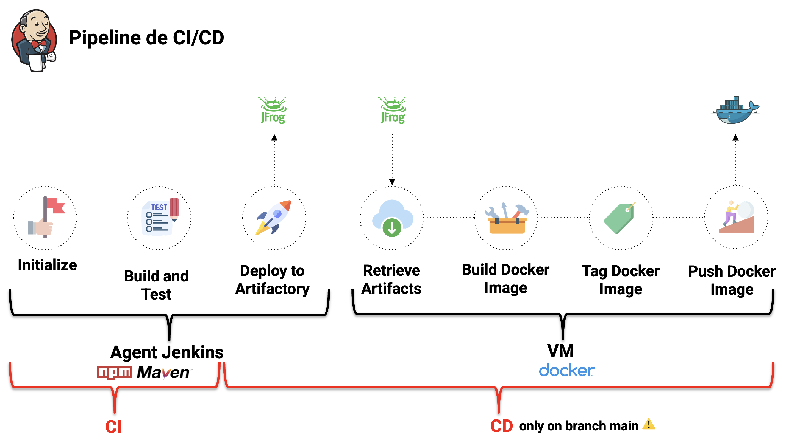

# Rapport DevOps

## Sommaire

##### I - Outils utilisés
##### II - Déroulement de la pipeline de CI/CD
##### III - Plan de Reprise d’Activité
##### IV - Credentials


## I - Outils utilisés
### 1. Outils d’intégration continue (CI)
        
L'intégration continue (CI) est une pratique de développement logiciel qui consiste à intégrer régulièrement, et de manière automatisée, les changements apportés par les développeurs dans un projet. L'objectif principal est de détecter rapidement les éventuelles erreurs et les conflits de code entre les différents modules du logiciel. Pour ce faire, des tests automatisés sont exécutés à chaque nouvelle intégration.
        
Nous utilisons l’outil suivant pour l’intégration continue :
        
- **Jenkins**
            
Jenkins est un outil open-source d’automatisation de build, de test et de déploiement qui permet d'optimiser les projets en automatisant les tâches répétitives, en favorisant l'intégration et le déploiement continus, en permettant la personnalisation et en améliorant la qualité globale du processus de développement et de déploiement.
            
La pipeline est déclenchée automatiquement à chaque commit. Grâce à Jenkins, nous pouvons surveiller et suivre l'état de notre pipeline de CI/CD en temps réel, ce qui nous permet de détecter rapidement les éventuelles erreurs, et éviter de les mettre en production (via les pull requests).
            
### 2. Outils de déploiement continue (CD)
        
Le déploiement continu est une pratique de développement logiciel qui vise à automatiser le processus de mise en production des changements apportés à un projet.
        
Nous utilisons les outils suivants pour le déploiement continue :
        
- **Artifactory**
            
Artifactory est un système de dépôt de fichiers versionnés où l’on va pouvoir stocker nos artifacts. Il va permettre d'optimiser le temps de déploiement sur Jenkins en stockant les artefacts dans un référentiel centralisé et en permettant une gestion efficace des versions des artefacts. 
            
- **Docker Hub**
            
Docker Hub est un registre public d'images de conteneurs Docker, qui permet aux développeurs de stocker, partager et distribuer des conteneurs Docker. Nous utilisons Docker Hub notamment pour la facilité de partage des images entre les developpeurs. 
            
## II - Déroulement de la pipeline de CI/CD
    
Notre pipeline de CI/CD est gérée par Jenkins. La partie CI est déclenchée automatiquement sur toutes les branches de notre projet à chaque modification de code. Cette partie utilise les outils Maven et NPM pour construire et tester notre code. En utilisant cette méthode, nous pouvons vérifier rapidement et efficacement nos modifications pour détecter les erreurs et les bugs potentiels avant de les déployer sur notre environnement de production, soit la branche “main”. Cela permet également aux différents membres du groupe de développer en parallèle sur différentes branches sans affecter l'intégrité du code.
    
En ce qui concerne la partie CD, nous avons configuré Jenkins pour déclencher cette partie seulement sur la branche “main”, qui représente notre environnement de production. Dans cette étape, nous avons automatisé le processus de déploiement de nos applications en poussant les fichiers jar et les packages NPM versionnés sur Artifactory. Nous utilisons ensuite ces artefacts pour construire des images Docker, qui sont ensuite taggées et poussées sur Docker Hub, afin d’être disponibles sur Internet.  En utilisant cette méthode, nous avons réussi à améliorer considérablement notre processus de développement en accélérant le déploiement de notre projet et en réduisant les risques d'erreurs et de bugs. 
    
Pour démarrer notre application, il faudra seulement de lancer le fichier **docker-compose.yml** fourni dans notre projet. Il permettra de démarrer les conteneurs du serveur, de la cli, des services de banque et de parking, et enfin de la base de données. Nous avons utilisé une image Docker PostgreSQL pré-existante pour lancer notre base de données en tant que conteneur. Cependant, nous voulions également nous assurer que les données stockées dans notre base de données étaient persistantes et ne seraient pas perdues en cas d'arrêt ou de redémarrage du conteneur. Pour cela, nous avons utilisé un volume Docker pour stocker les données de la base de données.
    

    
## III - Plan de Reprise d’Activité
### 1. Points critiques et causes potentielles d’incidents
        
La partie suivante décrit les points critiques de la pipeline de déploiement de notre projet, et propose des alternatives en cas d’indisponibilité de chaque composant de l’infrastructure. Les différentes parties sont classés du point le moins critique, au plus critique.
        
- **Smee**
            
Smee est un service gratuit qui permet de transmettre des messages webhook à un serveur local ou situé dans un réseau privé. Notre machine virtuelle étant dans le réseau privé de l’université, elle est protégée réseau privé virtuel (VPN), ce qui empêche les services tiers de communiquer directement avec notre serveur. Smee est utilisé pour contourner cette restriction en établissant une connexion sortante de notre réseau privé vers le serveur Smee hébergé sur Internet. Les événements webhook de GitHub sont envoyés à Smee, qui les transmet ensuite à notre application via la connexion sortante.
            
 **Alternative**
            
Si Smee.io est indisponible, il est possible de déployer notre propre instance de Smee sur un serveur. Smee est open-source et peut être exécuté localement ou déployé sur un serveur cloud. Des instructions détaillées pour déployer Smee sur GitHub : **[https://github.com/probot/smee#deploy-your-own-proxy](https://github.com/probot/smee#deploy-your-own-proxy).** Une autre alternative serait d'utiliser un autre service similaire à Smee, tel que Ngrok ou localtunnel.
            
- **Docker Hub**
            
En cas d'indisponibilité de Docker Hub, il est important de prendre quelques mesures pour assurer la continuité de nos opérations de déploiement et de gestion d'images Docker.
            
**Alternative**
            
            Artifactory peut être utilisé comme un registre Docker privé pour stocker des images Docker. Cependant, les images ne seront pas disponibles à l’extérieur de la VM. Sinon, il est également possible de ne pas fournir l’image Docker directement, mais plutôt les artefacts poussés sur Artifactory, ainsi que les Dockerfile. Il sera possible alors de construire soit-même sa propre image Docker.
            
- **Artifactory**
            
Nous utilisons la version open source de JFrog Artifactory. 
            
**Alternative**
            
En cas de problème, il existe plusieurs alternatives à Artifactory pour la gestion des artefacts. Nous pouvons citer par exemple GitHub Releases pour les exécutables .jar, et GitHub Packages pour les packages npm. Ce sont des alternatives tout de même limitée, ne prenant pas en compte la gestion du versionning. Il existe d’autres solutions à étudier, telles que Nexus Repository Manager, JFrog Bintray, Cloudsmith, etc.
            
- **Jenkins**
            
Jenkins est considéré comme un point critique car en cas de panne, les mises à jour de code peuvent ne pas être testées et déployées correctement, ce qui peut entraîner des erreurs. De plus, il est intégré avec des outils tiers (Artifactory, Docker Hub). En conséquence, une panne de Jenkins peut entraîner une interruption de l'ensemble de la chaîne d'outils de développement.
            
**Alternative** 
            
En cas de panne de Jenkins, Il est possible d’effectuer les différentes étapes localement (voir pipeline locale, partie Machine virtuelle), mais c’est un processus long qui peut laisser place à l’erreur humaine. En cas d’indisponibilité prolongée, il est possible de se tourner vers d’autres solutions telles que GitHub Actions. Il s'agit d'un service d'automatisation proposé par GitHub, qui permet d'automatiser les processus de build, de test et de déploiement d'applications directement à partir de votre dépôt GitHub. GitHub Actions est étroitement intégré avec GitHub, ce qui facilite la configuration et la gestion des workflows d'automatisation. C’est une alternative beaucoup plus limitée que Jenkins, mais qui fonctionnerait très bien dans le cadre de notre projet.
            
- **Github**
            
Une indisponibilité de GitHub peut entraîner des retards dans les contributions et la coordination entre les membres de l'équipe. Il sera également compliqué d’accéder aux dernières versions, versions précédentes du code ou à l'historique des modifications. Si le code n’a pas été sauvegardé, les seules versions disponibles seront celles sur les machines locales des contributeurs du projet. 
            
 **Alternative**          
            
Si une collaboration avec d'autres personnes est nécessaire et que GitHub est indisponible, il est possible de synchroniser le code via une autre plateforme de collaboration telle que GitLab ou Bitbucket, qui offrent des fonctionnalités similaires à GitHub. Sinon, il est également possible de lancer un serveur GitHub sur la VM.

Par ailleurs, pour ne pas perdre le repositorie hébergé sur GitHub, il faut penser à mettre en place un système de sauvegarde pour vos dépôts GitHub, en utilisant des outils tels que GitBackup ou GitMirror, qui permettent de cloner les dépôts GitHub vers une autre plateforme de gestion de versions ou de stockage de code.
            
- **Machine virtuelle**
            
La machine virtuelle (VM) représente le point critique le plus important de ce projet.
            
Il est possible de partir d’une VM vierge, auquel cas il faut suivre la procédure de réinstallation. Dans le cas où la VM a subit un redémarrage mais que tous les fichiers sont encore présents, il faut simplement suivre la procédure de redémarrage.
            
Enfin, il est possible que la machine virtuelle soit complètement indisponible. Dans ce cas, il est possible de passer par une pipeline locale, en clonant le projet sur sa machine depuis GitHub, à l’issue de laquelle nous pourrons trouver les dernières versions des images sur Docker Hub (non impacté par une indisponibilité de la VM).
            
**Alternative** Pipeline locale 
            
<u>Build & Test Maven + Docker Build</u>
            
Il faut créer des scripts de build qui compile chaque module et construit les images Docker.
            
```bash
# backend/build.sh
#!/bin/bash
echo "Compiling the TCF Spring BACKEND within a multi-stage docker build"
mvn clean package
docker build --build-arg JAR_FILE=target/backend-<version>.jar -t devopsteama/backend .
            
# cli/build.sh
#!/bin/bash
echo "Compiling the TCF Spring CLI within a multi-stage docker build"
mvn clean package
docker build --build-arg JAR_FILE=target/cli-<version>.jar -t devopsteama/cli .
            
# bank/build.sh
#!/bin/bash
echo "Compiling the NestJS Bank"
npm install
docker build -t devopsteama/bank .
            
# iswypls/build.sh
#!/bin/bash
echo "Compiling the NestJS Parking service"
npm install
docker build -t devopsteama/iswypls .
```
            
Enfin, il faut un script à la racine du projet : **build-all.sh**.
            
```bash
#!/bin/bash

function build_dir()  
{
    cd $1
    chmod u+x build.sh
    ./build.sh
    cd ..
}

echo "** Building all"

build_dir "cli"

build_dir "bank"

build_dir "iswypls"

build_dir "backend"

echo "** Done building all"
```
            
<u>Docker Tag & Push</u>
            
```bash
# TAG
docker tag devopsteama/backend:latest devopsteama/backend:${VERSION}
docker tag devopsteama/cli:latest devopsteama/cli:${VERSION}
docker tag devopsteama/iswypls:latest devopsteama/iswypls:${VERSION}
docker tag devopsteama/bank:latest devopsteama/bank:${VERSION}
# PUSH
docker push devopsteama/backend:${VERSION}
docker push devopsteama/cli:${VERSION}
docker push devopsteama/iswypls:${VERSION}
docker push devopsteama/bank:${VERSION}
```
            
Les dernières versions des images sont disponibles sur Docker Hub. Ce résultat est le même en passant par la pipeline locale ou en passant par la pipeline Jenkins. Nous pouvons donc démarrer les conteneurs en utilisant la commande suivante : `docker-compose up -d` (sans oublier de mettre à jour les versions dans le docker-compose.yml).
            
### 2. Procédure de réinstallation
        
**Temps nécessaire à la remise en marche ~ 2 heures** 
        
Cette procédure permet de recréer tout l’environnement et mettre en place tous les outils à partir d’une VM vierge.
        
#### **Jenkins**
            
💡 **Tutoriel Jenkins :** [https://www.cloudbees.com/blog/how-to-install-and-run-jenkins-with-docker-compose](https://www.cloudbees.com/blog/how-to-install-and-run-jenkins-with-docker-compose)


            
**Étape 1 -** Configurer le controller Jenkins.  Une fois sur la VM, lancer les commandes Jenkins :
            
```bash
# Donner les droits root pour plus de simplicité
sudo usermod -aG docker teama
# Créer un dossier qui contient toute la configuration Jenkins
mkdir jenkins_compose
cd jenkins-compose
```
            
**Étape 2 -** Créer, à partir de l’image Jenkins, une nouvelle image qui contient les outils nécessaires au build, test et déploiement du projet. Par exemple, nous avons installé maven, npm, docker-compose, etc.
            
```docker
# DockerFile jenkins_new
FROM jenkins/ssh-agent:jdk17
USER root

RUN apt-get update -y && \
    apt-get upgrade -y && \
    apt-get install -y wget && \
    apt-get install -y git && \
    apt-get install -y maven && \
    apt-get install -y docker-compose && \
    apt-get install -y npm && \ 
    npm install -g @nestjs/cli && \
    wget -qO - https://releases.jfrog.io/artifactory/jfrog-gpg-public/jfrog_public_gpg.key | apt-key add && \
echo "deb https://releases.jfrog.io/artifactory/jfrog-debs xenial contrib" | tee -a /etc/apt/sources.list && apt update &&  apt install -y jfrog-cli-v2-jf && jf intro

USER jenkins
```
            
Enfin, builder l’image Docker avec la commande suivante :
            
```bash
-docker build -t jenkins_new .
```
            
**Étape 3 -** Créer un docker-compose pour garantir la persistence des données. Il faut utiliser la nouvelle image jenkins génér et également choisir un port externe afin d’accéder à l’interface graphique (un port entre 8000 et 8030 qui n’est pas utilisé, ces ports autorisés à traverser le firewall. La deuxième ligne du volume permet de créer une socket docker qui donnera la possibilité à Jenkins de créer des conteneurs.
            
```yaml
# docker-compose.yaml
version: '3.8' # version du docker-compose à utiliser
services: # définition des services
  jenkins:
    image: jenkins/jenkins:lts
    privileged: true
    user: root
    ports:
      - 8000:8080
      - 50000:50000
    container_name: jenkins
    volumes:
      - /home/teama/jenkins_compose/jenkins_configuration:/var/jenkins_home
      - /var/run/docker.sock:/var/run/docker.sock
  agent:
    image: jenkins_new
    privileged: true
    user: root
    container_name: agent
    expose:
      - 22
    volumes:
      - /var/run/docker.sock:/var/run/docker.sock
```
            
**Étape 4 -** Démarrer le conteneur Jenkins et récupérer les identifiants de connexion :
            
```bash
docker-compose up -d # start container
docker logs jenkins | less # retrieve password 
```
            
Se rendre sur l’interface graphique > Entrer le password > **Install Suggested Plugins** > Créer un user (admin/admin) > **Save and Continue** > **Save and Finish.**
            
**Étape 5 -** Configurer l’agent Jenkins en SSH :
            
1. Générer la clé SSH avec : `sh-keygen -t ed25519`
2. Récupérer la clé ssh privée avec la commande : `cat **jenkins_agent**`
                
Dans Jenkins : **Manage Jenkins** > **Manage Credentials** > Click **Jenkins** under **Stores scoped to Jenkins** > **Global credentials** > **********Add Credentials********** > Select **SSH Username with private key** > Limit the scope to System > Give the credential an ID > Provide a description > Enter **jenkins** for a username > Under **Private Key,** check **Enter directly** > Paste the the contents of **jenkins_agent** file > ****OK.****
                
3. Récupèrer la clé ssh publique avec la commande : `cat **jenkins_agent.pub**`
Modifier le docker-compose.yml afin d’ajouter la clé publique en tant que variable d’environnement :
                
```yaml
# docker-compose.yaml
version: '3.8' # version du docker-compose à utiliser
services: # définition des services
  jenkins:
    image: jenkins/jenkins:lts
    privileged: true
    user: root
    ports:
      - 8000:8080
      - 50000:50000
    container_name: jenkins
    volumes:
      - /home/teama/jenkins_compose/jenkins_configuration:/var/jenkins_home
      - /var/run/docker.sock:/var/run/docker.sock
  agent:
    image: jenkins_new
    privileged: true
    user: root
    container_name: agent
    expose:
      - 22
    volumes:
      - /var/run/docker.sock:/var/run/docker.sock
    environment:
      - JENKINS_AGENT_SSH_PUBKEY=${PUBLIC_KEY}
```
                
**Étape 6 -** Stopper et redémarrer les conteneurs.
                
```bash
docker-compose down # stop
docker-compose up -d # start
```
                
**Étape 7 -** Configurer le wehbook sur [https://smee.io](https://smee.io). 
                
💡 **Tutoriel Smee :** [https://www.jenkins.io/blog/2019/01/07/webhook-firewalls/](https://www.jenkins.io/blog/2019/01/07/webhook-firewalls/)


                
Cliquer sur **Start a new channel** et récupérer le lien webhook généré. Ensuite, il faut créer un second webhook sur le repository GitHub : **Settings > Webhooks > Add webhook >** Copier le lien généré sur Smee dans la case **Payload URL** > Choisir **application/json** comme **Content Type** > Selectionner **Send me everything** > **Add webhook**.
                
Enfin, il faut lancer le client smee sur la VM. Nous utiliserons la commande screen afin de créer un terminal persistent pour que le client tourne en continu.
                
```bash
 screen -AdmSL smee-client smee --url ${SMEE_URL} --path /github-webhook/ --port ${PORT}
```
                
🚨 Le port du client doit être identique au port sur lequel tourne Jenkins !
                
**Étape 8 -** Définir l’agent Jenkins en tant que noeud.    
Aller sur l’interface Jenkins : **Manage Jenkins > Manage Nodes and Clouds > New Node >** Lui donner un nom (ex: jenkins_agent) > Choisir 1 comme **Number of executors >** Définir le **Remote root directory** à **/home/jenkins/agent >** Sélectionner **Use this node as much as possible** sous **Usage** > Définir **agent** dans la case **Host*** > dans **Credentials**, choisir **jenkins** (créé à l’étape 5) > Choisir **Non verifying Verification Strategy** sous **Host Key Verification Strategy >** Dans les paramètres avancées, donner le chemin vers Java sur la VM > **Enregistrer.**
                
✅ Il ne reste plus qu’à configurer la pipeline Jenkins dans un fichier Jenkinsfile à la racine du projet. Chaque commit déclenchera une pipeline accessible sur l’interface graphique de Jenkins.
                
#### **Artifactory**
            
💡 **Tutoriel :** [https://jfrog.com/knowledge-base/artifactory-installation-quick-start-guide-docker-compose/](https://jfrog.com/knowledge-base/artifactory-installation-quick-start-guide-docker-compose/)
            
**Étape 1 -** Télécharger le package docker-compose sur la plateforme de téléchargement JFrog ([https://jfrog.com/download-legacy/?product=artifactory&installer=docker-compose](https://jfrog.com/download-legacy/?product=artifactory&installer=docker-compose)). Nous pouvons soit le faire directement sur la VM, soit le télécharger sur sa propre machine et le transférer sur la VM à l’aide de la commande suivante :
            
```bash
sudo scp -rp jfrog-artifactory-oss-<version>-compose.tar.gz [teama@vmpx01.polytech.unice.fr](mailto:teama@vmpx01.polytech.unice.fr):
```
            
**Étape 2 -** Extraire les fichiers de l’archive à l’aide de la commande suivante :

```bash
tar -xzvf jfrog-artifactory-oss-<version>-compose.tar.gz
```
            
**Étape 3 -** Se placer dans le dossier artifactory et lancer le script de configuration suivant : 
            
```bash
cd artifactory-oss-<version>
./config.sh
```
            
Il faut presser la touche Entrée pour répondre aux deux premières questions (afin de ne pas modifier les valeurs par défaut), répondre **N** à la question “Are you adding an additional node to an existing product cluster?”,  répondre **N** à la question “Do you want to install PostgreSQL?” et choisir la database **derby** à la question suivante.
            
Une fois configuré, il faut modifier le venv et de modifier la variable **JF_ROUTER_ENTRYPOINTS_EXTERNALPORT** qui représente le port externe de l’interface graphique d’Artifactory. Il faut choisir un port entre 8000 et 8030 qui n’est pas utilisé (ports autorisés à traverser le firewall) afin de pouvoir y accéder via le navigateur de notre machine.
            
**Étape 4 -** Démarrer le conteneur de l’Artifactory en utilisant la commande suivante, et accéder à l’interface graphique afin de définir un mot de passe :
            
```bash
docker-compose -p rt up -d # start
docker-compose -p rt down # stop
```
            
**Étape 5 -** Configurer les repositories pour le déploiement des modules Java. On a deux repositories à configurer, celui des **snapshots** (instantané), et celui des **releases** (version stable)**.** Il faut suivre la même procedure pour les deux.
            
Aller sur l’interface graphique d’Artifactory via l’adresse de la VM et le port configuré. onglet **Application** > **Artifactory** > **Artifacts > Set Me Up >** Dans l’onglet **Configure**, cliquer sur **Generate Settings >** Copier les settings et coller le contenu dans un fichier dans le projet >. Modifier les paramètres identifiant, mot de passe, et modifier l’id **central** par **jenkins.** Ce fichier sera utilisé en tant que paramètre de la commande **mvn deploy**. Ensuite, aller dans l’onglet **Deploy**, copier le code et coller le contenu dans les fichiers pom.xml des modules Java que l’on souhaite pousser sur Artifactory.
            
**Étape 6 -** Pour déployer les packages npm sur Artifactory, nous utilisons la cli Jfrog que nous avons préalablement installé sur l’agent Jenkins. Il suffit seulement de fournir l’artefact à publier et le repositorie. 
            
```bash
jf rt upload ${PACKAGE} ${REPOSITORY_URL}
```
            
⚠️**Troubleshooting :** il se peut qu’il y ait un problème au moment de l’initialisation des services d’Artifactory. Dans ce cas, il faudra stopper le conteneur, supprimer le dossier **.jfrog** se trouvant dans le dossier **root**, et recommencer la procédure d’installation.
            
        
Enfin, il faudra penser à créer un repository sur Docker Hub afin de pouvoir stocker les images générées par notre chaîne de déploiement.
        
### 3. Procédure de redémarrage
        
**Temps nécessaire à la remise en marche ~ 1 minute**
        
Les fichiers sont persistants mais pas les conteneurs. Comme nous avons realisé toutes nos installations avec docker-compose, il très simple de relancer nos services en cas de redémarrage de la VM. Il faut seulement redémarrer les conteneurs de l’Artifactory et de Jenkins.
        
```bash
# Redémarrage de l'Artifactory
cd artifactory-oss-<version> && docker-compose -p rt up -d
# Redémarrage de Jenkins
cd jenkins_compose && docker-compose up -d
```
        
## IV - Credentials
    
Dans cette partie, nous retrouvons tout les endpoints de nos services, ainsi que les credentials afin de pouvoir se connecter dessus.
    
> **VM**      
hôte:[vmpx01.polytech.unice.fr](http://vmpx01.polytech.unice.fr/)      
user: teama	      
pass: FhD2kCegNtqamuEV      
> 
    
> **Smee**      
webhook : [https://smee.io/KQQg8sraoDboNsa](https://smee.io/KQQg8sraoDboNsa)      
> 
    
> **Jenkins**      
endpoint: [vmpx01.polytech.unice.fr](http://vmpx01.polytech.unice.fr/):8000      
user: admin            
password: admin      
> 
    
> **Artifactory**      
endpoint: [vmpx01.polytech.unice.fr](http://vmpx01.polytech.unice.fr/):8002      
user: admin      
password: Admin06.      
> 
    
> **Docker Hub**      
endpoint: [https://hub.docker.com/repositories/devopsteama](https://hub.docker.com/repositories/devopsteama)      
user: devopsteama      
password: TeamAdmin06.      
>
